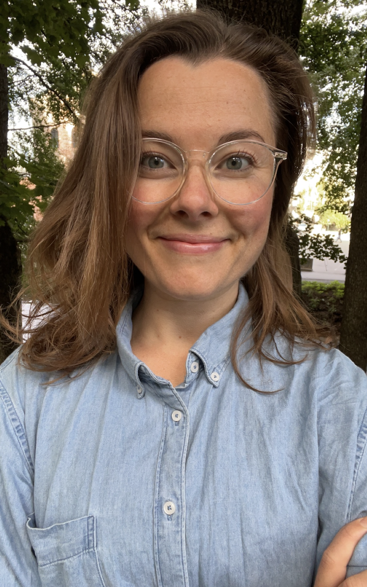

```{r include=FALSE}
library(fontawesome)
``` 

:::float-image

```{r, out.width='250px', out.extra='style="float:left; padding:10px"', echo=FALSE}



```

**PhD Candidate BI Norwegian Business School/Visiting Fellow Harvard University**

  Welcome to my website!
  
  
  I am a final-year PhD Candidate in Economics at BI Norwegian Business School. In my dissertation, I am using Natural Language Processing to study the behaviour of political elites, with a focus on how political parties are functioning as intermediaries between voters and politicians. At its core, my research touches on the underlying drivers and consequences of political polarization, populism, and (mis)representation.  
  
  Since August 2021, I have been affiliated with Harvard University as a Visiting Fellow at the Department of Government. In the fall, I will start as a Bruno Latour fellow at Sciences Po's Department of Economics, where I will be studying how trust in political elites affects green policymaking.  
  
  I have a Master's degree in Comparative Economics and Policy from University College London. My undergraduate studies cover economics, finance, business, and area and language studies.  
  
  You can find my CV [$\color{darkdarkblue}{\text{here}}$][CV], my Google Scholar profile [$\color{darkdarkblue}{\text{here}}$][GScholar], and read more about my research [$\color{darkdarkblue}{\text{here}}$](research.html)
   
  Supervisors: Prof. [Jon Fiva] and Prof. [Benny Geys]. 
  
   Feel free to contact me at [oda.nedregard@bi.no][email]
  
 
  [`r fa("twitter", fill = "steelblue")`](https://twitter.com/NedregardOda)
  [`r fa("envelope-open", fill = "steelblue")`][email]
  [`r fa("book", fill = "steelblue")`][GScholar]

  [email]: mailto:oda.nedregard@bi.no

  [CV]: https://www.dropbox.com/s/ds2thb6h70420lr/cv_nedregard.pdf?dl=0

  [GScholar]: https://scholar.google.com/citations?user=7HrD6BgAAAAJ
  
  [Jon Fiva]: https://www.jon.fiva.no/
 
  [Benny Geys]: https://www.bi.edu/about-bi/employees/department-of-economics/benny-geys/
   
  
:::


---
```{r setup, include=FALSE}
knitr::opts_chunk$set(echo = FALSE)

# Learn more about creating websites with Distill at:
# https://rstudio.github.io/distill/website.html

```

